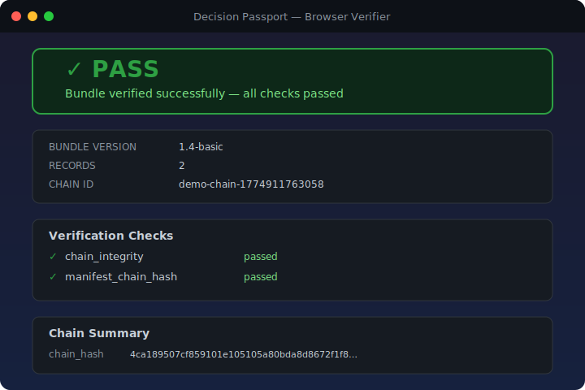
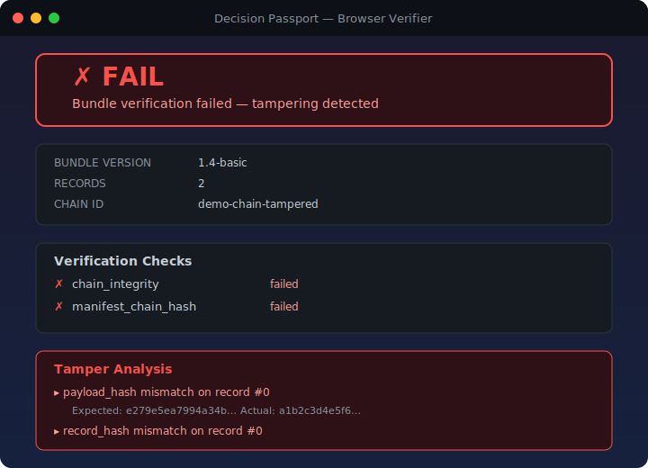

# Decision Passport: Core

[](https://github.com/brigalss-a/decision-passport-core/actions/workflows/ci.yml)
[](LICENSE)

offline-verifiable authorization and execution receipts for AI and high-consequence software actions

The trust layer for AI and high-consequence software actions. Every decision is traceable, exportable, and independently verifiable.

**TypeScript + Python reference** · **pnpm** · **Append-only chain** · **Offline verification** · **No database required**

---

## Trust panel

| Signal | Current status |
| --- | --- |
| Status | Public release track |
| API stability | Pre-1.0, changes possible |
| Verification scope | Hash-chain integrity plus manifest chain hash checks |
| Security disclosure | See `SECURITY.md`, report privately via email |
| Recommended usage | Proof layer for traceability and offline verification |
| Not yet included | Runtime enforcement, claim tokens, replay locks, signed bundles |

## v0.7.0 Core-First Scope Lock

Decision Passport v0.7.0 is implemented core-first in this repository.

For v0.7.0, this repository is the canonical source for:

1. model semantics
2. verifier semantics
3. fixture and golden output corpus
4. protocol/spec documentation

Primary v0.7.0 scope:

1. DecisionTrail
2. RuntimeClaim
3. OutcomeBinding
4. upgraded verifier semantics for authorization, runtime claim, and outcome linkage

Explicitly out of v0.7.0 scope:

1. hosted guard runtime implementation
2. enterprise-only control plane surfaces
3. broad signing/profile expansion without complete verifier and fixture coverage
4. UI-first feature expansion

Sovereign and OpenClaw Lite can adopt v0.7.0 semantics after they are locked in core. They do not define the canonical model for this release.

## v0.7.0 Implementation Truth Map

This section is normative for what this repository can prove today.

| Surface | v0.7.0 status | Truth statement |
| --- | --- | --- |
| DecisionPassport (bundle hash chain + manifest integrity) | Implemented | TypeScript and Python verifiers validate integrity, shape, and deterministic auditor outputs. |
| DecisionTrail (structured pre-action artifact) | Implemented (model + schema + verifier-visible linkage semantics) | Trail structure and linkage signals are modeled and validated on canonical fixtures; trail is not an authorization decision by itself. |
| DecisionGuard semantics (RuntimeClaim + fail-closed deny taxonomy) | Partially implemented | RuntimeClaim schema and verifier-visible outcomes are implemented; a full hosted/runtime guard executor is not included. |
| DecisionVerifier semantics | Implemented for v0.7.0 scope | Verifier exposes stable auditor fields and additive semantic statuses for authorization, payload binding, runtime claim, outcome linkage, revocation, supersession, and trail linkage. |

Spec-defined but not fully implemented in this release:

1. full runtime enforcement service behavior and orchestration
2. broad signing and key-management profiles
3. external notarization or identity attestation workflows

Future work (0.8.x or later):

1. hosted guard runtime and replay-state infrastructure
2. richer execution side-effect graph surfaces
3. expanded signing/profile ecosystem with complete parity fixtures

## What this proves

1. A bundle's record hashes, chain links, and manifest chain hash are internally consistent.
2. Payload tampering and chain mutation are detected by verification.
3. Verification runs offline with no database, API key, or cloud dependency.
4. v0.7.0 verifier semantics classify runtime-claim, outcome-linkage, revocation/supersession, and trail-linkage states on supported bundle surfaces.

## What this does not prove

1. Runtime policy enforcement at execution time.
2. Storage-level immutability by itself.
3. Who authored a bundle, unless a separate signing layer is used.
4. That a hosted guard executor blocked or allowed execution in real time.

## When to use this

Use this repository when you need portable, offline-checkable proof artifacts for AI action history.

## When you need stronger infrastructure

Use stronger infrastructure when you need execution claims, fail-closed guard enforcement, replay protection, tenant isolation, signed bundles, or regulated deployment controls.

## How this differs from logs, traces, and observability

Logs and traces are operational telemetry. Decision Passport Core is a verifiable proof format with canonical hashing and chain integrity checks. Observability helps you inspect behavior, this repo helps you verify integrity of exported proof artifacts.

## Verify in 60 seconds

```bash
git clone https://github.com/brigalss-a/decision-passport-core.git
cd decision-passport-core
pnpm install --frozen-lockfile
pnpm build
pnpm test
pnpm verify-demo
```

No database, API key, or cloud account required.

### First 5 Minutes (high-confidence path)

Use this exact sequence for a fast, trust-focused validation pass:

```bash
pnpm install --frozen-lockfile
pnpm build
pnpm test
pnpm conformance
pnpm verify-demo
pnpm example:smoke
python -m decision_passport.verify examples/reference-integrations/webhook-approval-receipt.bundle.json
python -m decision_passport.verify examples/reference-integrations/agent-tool-execution-receipt.bundle.json
```

If all commands pass, you have validated:

1. Core verifier correctness.
2. TypeScript/Python conformance parity.
3. Deterministic reference-integration behavior.
4. Auditor-grade output paths on canonical bundle surfaces.

Python reference implementation is available in `python/decision_passport_py` and mirrors the protocol surface for offline create and verify flows.

**What this verifies:**

1. The hash chain engine builds cleanly.
2. A decision chain can be created and exported.
3. The offline verifier confirms `PASS` when hashes and links are intact.
4. A tampered bundle is rejected as `FAIL`.
5. HTML verification reports are generated in `artifacts/`.
6. Current local validation for v0.7.0 release prep requires all release gates in `docs/release-checklist.md` to pass, including TypeScript suite, conformance parity, demo/reference checks, and Python verifier checks on reference bundles.

### Optional Python quick check

```bash
cd python/decision_passport_py
pip install -e .
python -m unittest discover -s tests -v
python -m decision_passport.verify ../../fixtures/valid-bundle.json
```

### Browser verifier

Serve the repo and open `apps/verifier-web/`. Drag any bundle JSON onto the page for client-side verification.

```bash
npx serve . -l 3000
# Open http://localhost:3000/apps/verifier-web/
```

<!-- markdownlint-disable MD033 -->
<p align="center">
  
</p>
<p align="center">
  
</p>
<!-- markdownlint-enable MD033 -->

---

## What is Decision Passport?

Decision Passport is an **append-only, hash-linked record system** for AI agent actions.

Every material action your AI agent performs, such as a recommendation, an approval decision, or an execution result, is stamped into a tamper-evident chain. That chain is bundled and can be independently verified offline.

This repository provides deterministic verification semantics through canonical hashing and explicit chain rules. Record creation still uses runtime UUID and timestamp values, so fixture regeneration is not byte-identical unless controlled inputs are used.

---

## Before / After

### Without Decision Passport

```text
AI agent runs, tool calls happen, results returned, nothing verifiable is exported.
Hard to explain what was decided.
Hard to prove what executed.
Hard to support external review.
```

### With Decision Passport

```text
AI agent runs, each material step is stamped into an append-only chain.
Bundle exported as portable JSON proof.
Verifier returns PASS when integrity checks succeed.
External reviewers can independently verify chain integrity.
```

---

## Quick example

```typescript
import { createRecord, createManifest } from '@decision-passport/core';
import { verifyBasicBundle } from '@decision-passport/verifier-basic';

const chainId = `session-${Date.now()}`;

// 1. Stamp each action
const record1 = createRecord({
  chainId,
  lastRecord: null,
  actorId: 'claude-agent-01',
  actorType: 'ai_agent',
  actionType: 'AI_RECOMMENDATION',
  payload: {
    rationale: 'Policy v2.1, action within approved risk threshold',
    confidence: 0.94,
    policy_version: 'v2.1'
  }
});

const record2 = createRecord({
  chainId,
  lastRecord: record1,
  actorId: 'alice@company.com',
  actorType: 'human',
  actionType: 'HUMAN_APPROVAL_GRANTED',
  payload: { note: 'Reviewed and approved' }
});

const record3 = createRecord({
  chainId,
  lastRecord: record2,
  actorId: 'claude-agent-01',
  actorType: 'ai_agent',
  actionType: 'EXECUTION_SUCCEEDED',
  payload: { result_summary: 'Email delivered', message_id: 'msg-8821' }
});

// 2. Export a portable proof bundle
const records = [record1, record2, record3];
const bundle = {
  bundle_version: '1.4-basic' as const,
  exported_at_utc: new Date().toISOString(),
  passport_records: records,
  manifest: createManifest(records)
};

// 3. Verify independently (no network, no database)
const result = verifyBasicBundle(bundle);
console.log(result.status); // 'PASS'
```

---

## Tool Call Wrapper

Wrap any async tool/function call and export a portable proof bundle that can be verified offline.

```typescript
import { withDecisionPassportToolCall, verifyToolCallReceipt } from '@decision-passport/tool-call-wrapper';

const receipt = await withDecisionPassportToolCall({
  tool: { name: 'send-email', version: '1.0' },
  actor: { id: 'claude-agent-01', type: 'ai_agent' },
  input: { to: 'alice@example.com', subject: 'Hello' },
  authorization: { approved: true, authorizationType: 'policy', policyVersion: 'v2.1' },
  execute: async (ctx) => {
    return { messageId: 'msg-001', delivered: true };
  }
});

console.log(receipt.status);           // 'SUCCESS'
console.log(receipt.inputHash);        // SHA-256 of normalized input
console.log(receipt.outputHash);       // SHA-256 of normalized output
console.log(receipt.verification.ok);  // true — bundle verified offline

const verification = verifyToolCallReceipt(receipt.bundle);
console.log(verification.ok);  // true
```

**What this proves:**
- The tool was called with a specific input (input hash)
- The tool produced a specific output (output hash)
- Authorization was granted before execution
- The full lifecycle is recorded in a tamper-evident chain

**What this does not prove:**
- That the agent identity is cryptographically verified
- That the tool execution was runtime-enforced
- That replay attacks are prevented

See [docs/TOOL_CALL_WRAPPER.md](docs/TOOL_CALL_WRAPPER.md) for full API reference.

---

## Batch Verification

Decision Passport can verify individual receipts or batch-verify receipt sets for audit and conformance workflows.

```typescript
import { verifyBundleBatch, createVerificationAuditReport } from '@decision-passport/verifier-basic';

const report = verifyBundleBatch([bundle1, bundle2, bundle3], { label: 'audit-q1' });

console.log(report.passedCount);   // 2
console.log(report.failedCount);   // 1
console.log(report.failureSummary.byClass);
// { CHAIN_BREAK: 0, TAMPERED_PAYLOAD: 1, MALFORMED_BUNDLE: 0, ... }

// Export a Markdown audit report
const artifact = createVerificationAuditReport(report, { format: 'markdown' });
console.log(artifact.content);
```

**What this proves:**
- A set of bundles verified against the same deterministic offline rules as individual verification
- Failures classified into stable machine-readable categories
- Audit reports reproducible at any time from the same bundle set

**What this does not prove:**
- GPU acceleration, AI factory runtime integration, real-time monitoring, or cloud audit services

See [docs/BATCH_VERIFICATION.md](docs/BATCH_VERIFICATION.md) for full API reference.

---

## Architecture

```text
decision-passport-core/
├── packages/
│   ├── core/               ← Hash chain engine
│   │   ├── src/types.ts         ActionType, PassportRecord, ChainManifest, BasicProofBundle
│   │   ├── src/chain.ts         createRecord(), verifyChain(), assertValidChain()
│   │   ├── src/hashing.ts       hashCanonical(), hashPayload(): SHA-256, deterministic
│   │   ├── src/canonical.ts     Canonical JSON serialiser (no duplicate hashing)
│   │   ├── src/manifest.ts      createManifest()
│   │   ├── src/explain-tamper.ts explainTamper(): what changed and why it broke
│   │   ├── src/bundle-diff.ts   diffBundles(): compare two bundles field by field
│   │   └── src/errors.ts        ChainValidationError
│   │
│   ├── verifier-basic/     ← Offline bundle verifier
│   │   ├── src/verify-bundle.ts   verifyBundle(): zero external deps
│   │   └── src/html-report.ts     renderVerificationReport(): static HTML export
│   │
│   └── demo/               ← Runnable demo
│       └── src/index.ts         Full demo: record → export → verify → PASS
│
├── apps/
│   └── verifier-web/       ← Browser verifier (drag-and-drop, zero dependencies)
│
├── fixtures/               ← Deterministic conformance fixtures
│   ├── valid-bundle.json
│   ├── tampered-bundle.json
│   ├── broken-prev-hash.json
│   ├── wrong-sequence.json
│   ├── wrong-chain-hash.json
│   ├── malformed-bundle.json
│   ├── unsupported-version.json
│   └── compatible-optional-metadata.json
│
├── python/
│   └── decision_passport_py/    ← Python reference implementation (offline-first)
│
└── artifacts/              ← Generated by verify-demo
    ├── verification-report.html
    ├── tampered-report.html
    └── verification-summary.json
```

### Trust chain model

```text
PassportRecord[0]        PassportRecord[1]        PassportRecord[2]
─────────────────        ─────────────────        ─────────────────
id: uuid                 id: uuid                 id: uuid
sequence: 0              sequence: 1              sequence: 2
prev_hash: GENESIS       prev_hash: hash[0]       prev_hash: hash[1]
payload_hash: sha256     payload_hash: sha256     payload_hash: sha256
record_hash: sha256 ──►  record_hash: sha256 ──►  record_hash: sha256
                                                          │
                                                          ▼
                                               ChainManifest
                                               chain_hash = record_hash[2]
                                                          │
                                                          ▼
                                               BasicProofBundle
                                               (portable · verifiable · exportable)
```

Tampering with any single byte in any record breaks every subsequent hash. The chain becomes self-auditing.

---

## Core concepts

### PassportRecord

The atomic unit of trust. Every record contains:

| Field | Description |
| --- | --- |
| `id` | UUID |
| `chain_id` | Session identifier |
| `sequence` | Monotonic counter (0, 1, 2, ...) |
| `timestamp_utc` | ISO 8601 timestamp |
| `actor_id` | Who acted (agent ID, user email, system name) |
| `actor_type` | `human` / `ai_agent` / `system` / `policy` |
| `action_type` | Category (see below) |
| `payload` | Action data (structured) |
| `payload_hash` | SHA-256 of payload |
| `prev_hash` | Hash of previous record (or `GENESIS`) |
| `record_hash` | SHA-256 of the full record (excluding itself) |
| `metadata` | Optional: environment, tenant, policy refs |

### Action types

```typescript
type ActionType =
  | 'AI_RECOMMENDATION'       // Agent produces a decision
  | 'HUMAN_APPROVAL_GRANTED'  // Human approves
  | 'HUMAN_APPROVAL_REJECTED' // Human rejects
  | 'POLICY_APPROVAL_GRANTED' // Policy engine approves
  | 'EXECUTION_PENDING'       // Action queued
  | 'EXECUTION_SUCCEEDED'     // Action completed successfully
  | 'EXECUTION_FAILED'        // Action failed
  | 'EXECUTION_ABORTED'       // Action cancelled
  | 'HUMAN_OVERRIDE'          // Human overrides system decision
  | 'POLICY_EXCEPTION';       // Exception granted
```

### ChainManifest

Chain summary: `chain_id`, `record_count`, `first_record_id`, `last_record_id`, `chain_hash`.

### BasicProofBundle

The portable export format (`bundle_version: "1.4-basic"`). Contains all records + manifest. Self-contained, verifiable offline.

---

## Offline verification

```typescript
import { verifyBasicBundle } from '@decision-passport/verifier-basic';
import fs from 'fs';

const bundle = JSON.parse(fs.readFileSync('./bundle.json', 'utf8'));
const result = verifyBasicBundle(bundle);

console.log(result.status);  // 'PASS' | 'FAIL'
console.log(result.summary);      // short human summary
console.log(result.reasonCodes);  // stable machine-readable reason codes
console.log(result.checks);       // array of individual check results
console.log(result.nextSteps);    // concise triage guidance on FAIL
```

A CLI verifier is also available at `packages/verifier-basic/src/cli.ts`:

```bash
pnpm tsx packages/verifier-basic/src/cli.ts ./bundle.json
```

### Bundle diff

Compare two bundles to see exactly what changed:

```bash
pnpm diff-bundles fixtures/valid-bundle.json fixtures/tampered-bundle.json
```

Or use the API:

```typescript
import { diffBundles } from '@decision-passport/core';

const result = diffBundles(bundleA, bundleB);
console.log(result.identical); // false
console.log(result.summary);   // '1 difference(s) found: 1 field change(s).'
console.log(result.findings);  // structured diff findings
```

### Python reference implementation

The Python package in `python/decision_passport_py` is protocol-first and offline-only, not an API wrapper.

```bash
cd python/decision_passport_py
pip install -e .
python -m decision_passport.verify ../../fixtures/valid-bundle.json
python -m decision_passport.diff ../../fixtures/valid-bundle.json ../../fixtures/tampered-bundle.json
```

The verifier checks:

1. Every `record_hash` matches the recomputed deterministic hash
2. Every `prev_hash` correctly chains to the previous record
3. Sequence numbers are gapless and correct
4. `chain_hash` in the manifest matches the terminal record

If the input is malformed, verification returns `FAIL` with a structure reason code.
If integrity checks fail, verification returns `FAIL` with integrity reason codes.

### Schema and compatibility

- [Schema and versioning](docs/schema-versioning.md): bundle structure, record fields, hashing rules, evolution guidance
- [Compatibility matrix](docs/compatibility-matrix.md): which tools work with which formats
- [Verifier compatibility promise](docs/verifier-compatibility-promise.md): 12-month supported/deprecated/unsupported policy
- [Verifier auditor output](docs/verifier-auditor-output.md): deterministic verdict/code/location/reason/remediation_hint contract
- [Protocol conformance](docs/protocol-conformance.md): normative verifier checks and fixture outcomes
- [Conformance manifest](fixtures/conformance-manifest.json): machine-readable expected verdict map for canonical fixtures
- [JSON Schemas](docs/json-schema/): machine-readable schemas for `BasicProofBundle`, `ChainManifest`, `PassportRecord`
- [Release verification](docs/release-verification.md): how to verify a published release locally
- [Release provenance](docs/release-provenance.md): official release artifacts, 3-minute local verification, and trust limitations
- [Reference integrations](examples/reference-integrations/README.md): two ultra-small end-to-end examples (webhook approval receipt and agent/tool execution receipt)
- [Append-only guarantees](docs/append-only-guarantees.md): what the protocol enforces, what verification detects, storage-level limits
- [Bundle Diff](docs/bundle-diff.md): how to compare two bundles, generate diff artifacts, and interpret findings

### Trust model docs

- [Boundaries](docs/BOUNDARIES.md): exact scope, non-goals, and trust boundary edges
- [Threat model](docs/THREAT_MODEL.md): addressed threats, assumptions, and residual risk
- [Verification model](docs/VERIFICATION_MODEL.md): PASS and FAIL semantics, safe interpretation
- [Tamper cases](docs/TAMPER_CASES.md): concrete failure patterns and investigation guidance

---

## Lite vs Enterprise

| Capability | Core (this repo) | Enterprise (private) |
| --- | --- | --- |
| Append-only hash chain | ✓ Free | ✓ |
| Basic bundle export (JSON) | ✓ Free | ✓ |
| Offline verifier | ✓ Free | ✓ |
| CLI verifier | ✓ Free | ✓ |
| Demo + examples | ✓ Free | ✓ |
| Execution claims (single-use auth tokens) | N/A | ✓ |
| Guard enforcement (blocking before execution) | N/A | ✓ |
| Replay protection (nonce + TTL) | N/A | ✓ |
| Outcome binding (cryptographic result sealing) | N/A | ✓ |
| PostgreSQL persistence | N/A | ✓ |
| Redis distributed locking | N/A | ✓ |
| Merkle proof bundle | N/A | ✓ |
| Advanced verifier (enterprise-grade) | N/A | ✓ |
| Sovereign signed bundles (HMAC-SHA256) | N/A | ✓ |
| Air-gapped verifier packaging | N/A | ✓ |
| Dashboard + live backend | N/A | ✓ |
| SSO / RBAC / tenant isolation | N/A | ✓ |

---

## Commercial paths

Core is free and open source.

Hosted, business, enterprise, and sovereign deployment options are available on request.

Contact: [contact@bespea.com](mailto:contact@bespea.com)

---

## Roadmap

- [x] Core hash chain engine
- [x] BasicProofBundle export
- [x] Offline verifier (zero-dependency)
- [x] CLI verifier
- [x] Demo with sample data
- [x] Tamper explainer (`explainTamper()`: what changed and why it broke)
- [x] HTML verification report export
- [x] Browser verifier (drag-and-drop, client-side only)
- [x] Deterministic valid + tampered fixtures
- [ ] ASCII chain visualiser
- [ ] Policy version binding helpers
- [ ] Redaction mode (`metadata-only` and `hash-only` bundles)
- [x] Bundle diff utility (`diffBundles()`: compare two bundles)
- [ ] OpenClaw Lite bridge (see `decision-passport-openclaw-lite`)
- [ ] Trusted timestamping integration (RFC 3161)

---

## Repo map

This repository is the **public protocol layer**. The full ecosystem:

| Repo | Visibility | Purpose |
| --- | --- | --- |
| `decision-passport-core` | **Public** | This repo: protocol, chain, basic verifier |
| `decision-passport-openclaw-lite` | **Public** | OpenClaw integration bridge (Lite) |
| `decision-passport-control-plane-real` | **Private** | Claims, guard, replay, outcomes, persistence |
| `decision-passport-sovereign-real` | **Private** | Signed bundles, air-gapped verifier |

---

## External Technical Validation

To keep this repository technically honest, we keep public feedback channels focused on reproducible verifier and conformance evidence.

- Adoption and validation signals: `docs/adoption-signals.md`
- Verifier contract feedback template: `.github/ISSUE_TEMPLATE/verifier-contract-feedback.md`
- Conformance/integration feedback template: `.github/ISSUE_TEMPLATE/conformance-or-integration-feedback.md`

When reporting feedback, include exact commands, fixture/bundle inputs, and expected vs actual verifier outputs.

---

## Contributing

Contributions to the public protocol are welcome.

Fork the repository on GitHub, then run:

```bash
git clone https://github.com/YOUR_USERNAME/decision-passport-core.git
cd decision-passport-core
git checkout -b feat/my-improvement
pnpm install --frozen-lockfile
pnpm test
```

Then open a pull request with a clear description of what changed and why.

---

## License

[Apache-2.0](LICENSE). See full text in LICENSE file.

> You may use, modify, and distribute this software freely, including in commercial products. The express patent grant protects you and your users. Product names, logos, and hosted offerings remain the intellectual property of Bespoke Champions League Ltd.

---

## About

Decision Passport is built and maintained by Bespoke Champions League Ltd, London, United Kingdom.

It powers the trust layer inside [Bespea](https://bespea.com). Decision Passport emerged from a real-world problem: AI systems making material delivery, execution, and approval decisions without a portable, verifiable record.

Maintainer:
Grigore-Andrei Traistaru
Founder
<contact@bespea.com>
<https://bespea.com>
